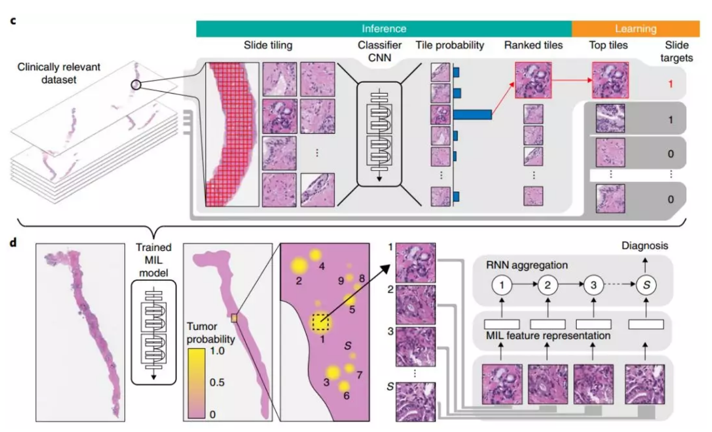

> **Clinical-grade computational pathology using weakl论文中对WSI图像MIL训练过程的实现**

- **论文地址**：https://www.nature.com/articles/s41591-019-0508-1
- **官方 Github**：https://github.com/MSKCC-Computational-Pathology/MIL-nature-medicine-2019
- **参考 Github**：https://github.com/TankZhouFirst/clinical-grade-computational-pathology-using-weakly-supervised-deep-learning-on-whole-slide-images
****

**论文代码的适用场景**

原论文是针对弱监督情况下对病理图像进行是否存在肿瘤区域(或其他异常区域，本例以肿瘤区域作为说明)的二分类判断,所谓弱监督是因为只有整张病理图片的标签但没有具体肿瘤区域的标注。在这个场景下，标记为肿瘤的病理图片至少会有一处区域是属于肿瘤的，而正常的病理图片则肯定是没有一处是肿瘤的。换言之，假设正常是0类，肿瘤是1类，其实在这两类在数值上是存在向下兼容的(1预测为0相对来说可以容忍，0预测为1则完全不能容忍。)，可以适当修改loss函数进行相应的加权或者惩罚(论文和官方代码没有提及这点)。而在官方代码中，指定使用预测为1类的概率(他们默认1类为肿瘤样本)作为top k比较的依据是可行的，因为一来这是两分类，二来这种两分类存在上下兼容关系，不管病理图片的实际标签是哪个分类，由于只对1类感兴趣，因此在整个MIL训练过程只选出预测1分类概率最高的top k作为整体代表是可行的。

然而如果是另一个场景，如果不是进行正常/肿瘤的判断，而是进行MSI/MSS这种不存在上下兼容关系的二分类或者多分类场景，即WSI的实际分类可能是基于图片中预测为所属类的区域最多者作为最终的预测结果的时候，上述默认只关注某一类预测概率的选择逻辑未必能适用。由于目前MSI和MSS这种基于基因表达上的差异能否通过WSI图像+深度学习的方法判断出来尚未得到确切论证(虽然已经有论文用MIL的思路尝试进行训练了)。在这种情况下，就不能直接用官方原来的代码思路进行训练了，后续我会给出具体的修改方案。
****

##  Installation ##

```pip install -r requirements.txt```
****


## 本人改进部分 ##

基于上述[TankZhouFirst](https://github.com/TankZhouFirst/clinical-grade-computational-pathology-using-weakly-supervised-deep-learning-on-whole-slide-images)和[官方](https://github.com/MSKCC-Computational-Pathology/MIL-nature-medicine-2019)的代码,对**dataPrepare_for_CNN.py**和**MIL_train.py**的内部逻辑进行了比较大的调整,但是整体执行方式维持不变,以下是具体修改说明:


#### dataPrepare_for_CNN.py ####


1. 增加针对WSI图像**mpp**(0级下每像素代表多少微米,一般20X是0.5左右,40X是0.25左右)不同而自适应调整**patch size**的逻辑，并且**patch size**从保存固定值改为以列表形式保存，相关的读取修改已经在此前的提交中同步到`MIL_train_tqdm`(现已命名为`TUM_Identify_MIL_train`)中。

2. 原来的官方代码只是以设定的**patch size**对WSI文件进行全图坐标遍历，却没有考虑到实际上WSI中包含不少背景区域，全图无差别遍历会收集不少背景区域的坐标，而这些区域往往是无意义的。此次修改先对每一个WSI图片生成背景/组织区域的mask，然后只限定在组织区域内(基于mask)进行遍历，以生成需要保存的坐标组。

3. 考虑到即使只在组织区域进行遍历，采样出来的样本还是可能过大，导致筛选特征时耗时过长，不易于训练，因此我增设一个基于概率进行采样的机制。以计算每个WSI图片背景占全图的比例为采样概率，在遍历坐标并进行记录前先执行是否通过概率的判断，通过才保存该组坐标。如果是组织越多的图片，遍历时每一组坐标被采样的概率就越低，反之就越高，这样既能控制数量，也能实现均衡化采样。

4. 只保留采样的坐标组大于指定数量(目前是只保留>5)的样本和他的坐标，确保保存到lib中的都能满足基本**top k**需求(我一般设置k为5或10)。


#### TUM_Identify_MIL_train.py ####

官方代码中，训练脚本原名为`MIL_train.py`,我这里将其重命名为`TUM_Identify_MIL_train.py`，以示专用于上述说明中提到的分类类别存在上下兼容关系的分类场景(比如判别正常/肿瘤)。

1. 首先在[TankZhouFirst](https://github.com/TankZhouFirst/clinical-grade-computational-pathology-using-weakly-supervised-deep-learning-on-whole-slide-images)注释的基础上对`group_argtopk`、`group_max`方法以及类`MILdataset`中的内部变量进行较为详尽的补充说明。

2. 修改`calc_accuracy`方法,取消原来的**err**和**fpr**，改为引入`sklearn.metrics`包的`balanced_acc`和`recall`作为新的统计指标。

3. 修改`inference`方法,增加**avg_prob**以及**whole_probably**的计算,前者在`tqdm`中显示.后者在**inferencing**后进行打印显示到屏幕。

4. 在`main`函数中,增加每一轮**top k**的保存,并且根据当前值和上一轮的值的变化而制定**early stopping**策略;同时修改每一轮训练后记录在日志上的变量;最后修改保存最佳模型的判断条件。

5. 针对`MILdataset`类,新增**patch size**的读取(每一个**slide**文件对应一个**patch size**数值);在`maketraindata`方法中新增复制采样的方法,为后面在`__getitem__`中采用不同参数的`adjust_hue`方法打下基础。颜色转换的操作放在在`__getitem__`中进行而不是在`transforms.Compose`中进行，确保在预测/计算概率的时候不进行任何变换，只在**train**的时候才引入变换。

6. 将原来日志输出通过`print`打印到屏幕改为使用`tqdm`库动态在屏幕显示输出，能实时监控每个batch对应评估指标的数值。效果大致如下：


****

> **论文中MIL过程原理图如下**



****

##  程序运行说明 ##
可以直接看官方的[README](https://github.com/MSKCC-Computational-Pathology/MIL-nature-medicine-2019)文档，该文档也作为README文档放在./doc/下。


可以参考[TankZhouFirst](https://github.com/TankZhouFirst/clinical-grade-computational-pathology-using-weakly-supervised-deep-learning-on-whole-slide-images)用中文重新编写的文档，见[./doc/Clinical-grade computational pathology using weakly supervised deep learning on whole slide images.md](https://github.com/BohriumKwong/using-weakly-supervised-deep-learning-on-whole-slide-images/blob/master/doc/Clinical-grade%20computational%20pathology%20using%20weakly%20supervised%20deep%20learning%20on%20whole%20slide%20images.md)


> **Training**

在`dataPrepare_for_CNN.py`脚本中第14行设置好读入图片的文件路径(一级目录,默认后缀名是**svs**，但也有后缀名为**ndpi**的WSI文件)，以及在第138/145行设置好生成的db文件保存路径，然后直接运行`python dataPrepare_for_CNN.py`，则可完成对文件路径内所有WSI文件的用于MIL过程的坐标遍历结果(***_data_lib.db**文件)。

之后在`TUM_Identify_MIL_train.py`中main函数的传参列表中设置好相应参数，然后直接运行`python TUM_Identify_MIL_train.py`就可以开始训练，参数列表设置如下：

```python
parser = argparse.ArgumentParser(description='MIL-nature-medicine-2019 tile classifier training script')
parser.add_argument('--train_lib', type=str, default='output/lib/512/cnn_train_data_lib.db', help='path to train MIL library binary')
parser.add_argument('--val_lib', type=str, default='output/lib/512/cnn_val_data_lib.db', help='path to validation MIL library binary. If present.')
parser.add_argument('--output', type=str, default='output/', help='name of output file')
parser.add_argument('--batch_size', type=int, default=256, help='mini-batch size (default: 512)')
parser.add_argument('--nepochs', type=int, default=50, help='number of epochs')
parser.add_argument('--workers', default=0, type=int, help='number of data loading workers (default: 4)')
# 如果是在docker中运行时需注意,因为容器设定的shm内存不够会出现相关报错,此时将num_workers设为0则可
parser.add_argument('--weights', default=0.79, type=float, help='unbalanced positive class weight (default: 0.5, balanced classes)')
parser.add_argument('--k', default=5, type=int, help='top k tiles are assumed to be of the same class as the slide (default: 1, standard MIL)')
```
其中训练执行顺序是先对全体train数据集进行infering，确定top k的index之后再对筛选后的数据进行训练，之后是对全体val数据集进行inferring，这样就完成一轮。执行时输出的结果如下：

Number of tiles: 46539
Epoch:1 train's inferencing: 100%|██████████| 1097/1097 [4:43:53<00:00, 43.75s/it, average mis probably - 0.1555]
Epoch:1 is trainng: 100%|██████████| 20/20 [08:39<00:00, 14.07s/it, acc - 0.6627, recall - 0.6279, fnr - 0.2857, loss - 0.6129]
Training        Epoch: [1/50] Acc: 0.617 Recall:0.659 Fnr:0.46 Loss: 0.656
Epoch:1 val's inferencing: 100%|██████████| 182/182 [2:17:09<00:00, 39.40s/it, average mis probably - 0.1712]
Validation  Epoch: [1/50]  acc - 0.5118, recall - 0.7013, fnr - 0.1639
Epoch:2 train's inferencing: 100%|██████████| 1097/1097 [4:56:36<00:00, 37.13s/it, average mis probably - 0.2188]
Epoch:2 is trainng: 100%|██████████| 20/20 [07:54<00:00, 12.94s/it, acc - 0.7475, recall - 0.6977, fnr - 0.1667, loss - 0.4709]
Training        Epoch: [2/50] Acc: 0.715 Recall:0.687 Fnr:0.236 Loss: 0.556
Epoch:2 val's inferencing: 100%|██████████| 182/182 [2:18:46<00:00, 44.21s/it, average mis probably - 0.1253]
Validation  Epoch: [2/50]  acc - 0.4372, recall - 0.5649, fnr - 0.3443

···


> **testing**
维持官方代码的运行方法，设置好相关配置后直接运行`python MIL_test.py`则可。

**输出如下**

| Pred \ target |  1   |  0   |
| :-----------: | :--: | :--: |
|       1       |   11   |   1   |
|       0       |   2   |   31   |

ACC = 42 / 45 = 93.3%
FNR = 2 / 13 = 15.4%
FPR = 1 / 32 = 3.1%
